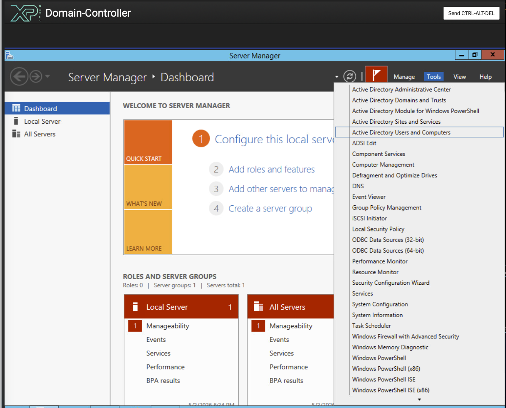
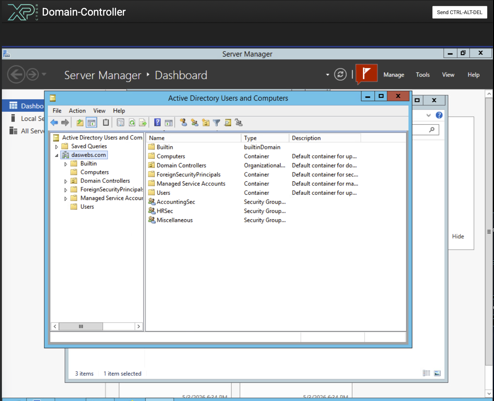
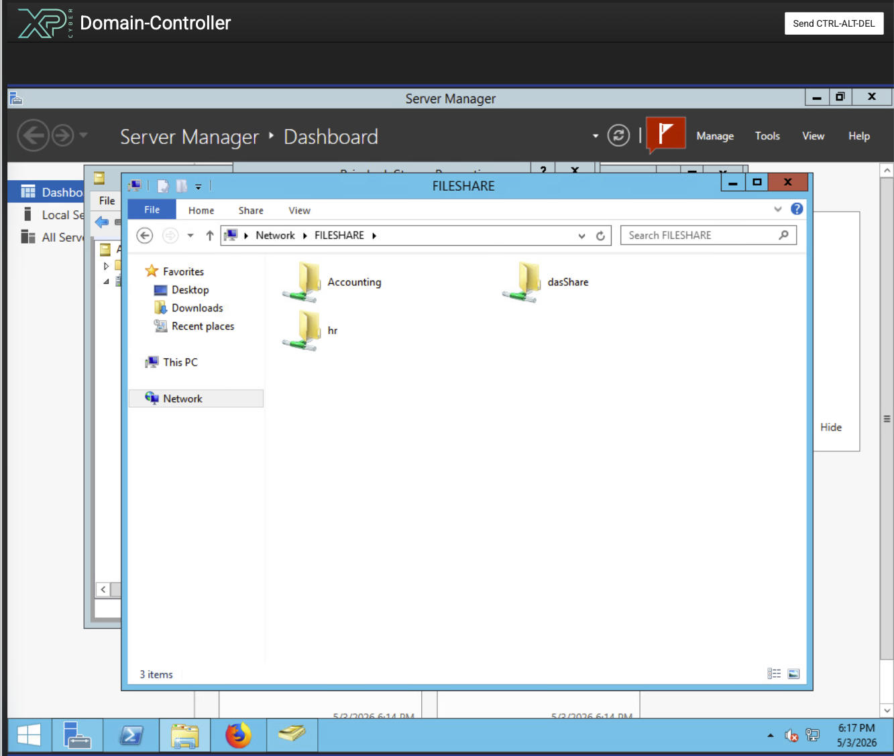

# Active Directory Security Hardening (XP Cyber Lab)

## Objective
Fix domain-wide access control issues by implementing proper security groups, permissions, and restrictions.

### Step 1: Access Domain Controller
Log in with Domain Admin credentials

### Step 2: Create Security Groups
1. Open Active Directory Users and Computers (ADUC)
2. Navigate to appropriate OU (e.g., Users or create a "Security Groups" OU)
3. Create the following groups:
• HRSec
• AccountingSec
• Miscellaneous

Steps:
• Right-click → New → Group
• Name group → Set:
• Group scope: Global
• Group type: Security

### Step 3: Assign Users to Groups
Add users as follows:
• Sergio Chanel → HRSec
• Brimlock Stones → AccountingSec
• All other non-admin users → Miscellaneous
Steps:
1. Double-click group → Members tab
2. Click "Add"
3. Select users → Apply

### Step 4: Disable Rob's Account
1. In ADUC, locate Rob's account
2. Right-click → Disable Account

### Step 5: Restore Domain Admin Privileges
1. Navigate to Domain Admins group
2. Add user: gthatcher

### Step 6: Configure Logon Restrictions
Restrict Sergio and Brimlock to only log into Workstation-Desk
Steps:
1. In ADUC:
• Open user properties (Sergio / Brimlock)
• Go to Account tab
• Click Log On To...
• Select:
• "The following computers"
• Add: Workstation

### Step 7: Configure Share Permissions (Fileshare Server)
Access Fileshare:
• Open File Explorer → navigate to:  \\FILESHARE\

HR Share Permissions
1. Right-click HR Share → Properties
2. Go to:
• Sharing tab → Advanced Sharing → Permissions
• Security tab
Configure:
• Allow:
• HRSec → Read/Write/List
• Domain Admins → Full Control
• Deny:
• AccountingSec
• Miscellaneous
Remove "Everyone" if present

Accounting Share Permissions
Repeat same process:
• Allow:
• AccountingSec → Read/Write/List
• Domain Admins → Full Control
• Deny:
• HRSec
• Miscellaneous

Remove "Everyone" if present

